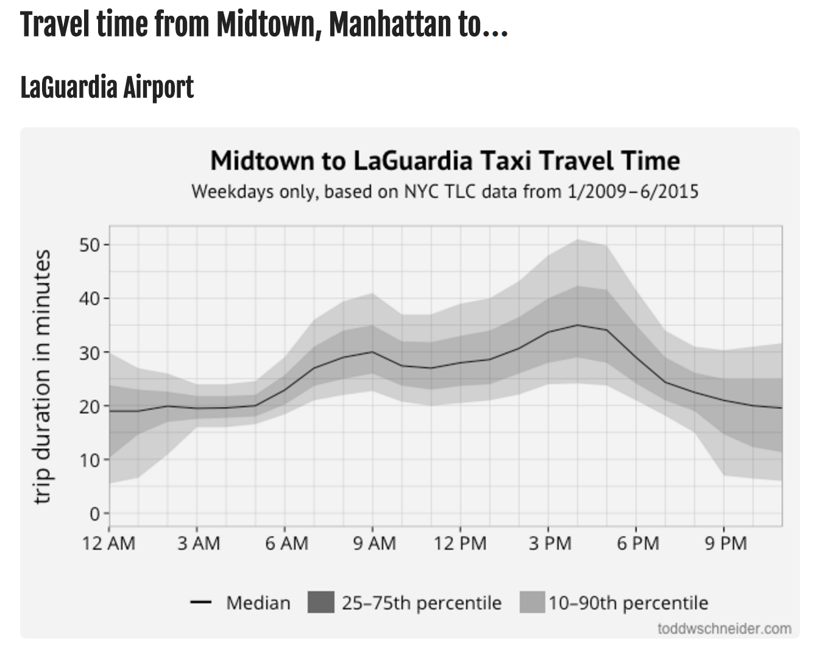

Bay Area Bike Share - Time
================
Oskar Triebe

-   [Expected Travel Times for Bay Area Bike Share](#expected-travel-times-for-bay-area-bike-share)
    -   [Description - Bay Area Bike Share](#description---bay-area-bike-share)
    -   [Load Data](#load-data)
    -   [Analyze Data](#analyze-data)
    -   [Plot Travel Time for Routes](#plot-travel-time-for-routes)

``` r
library(tidyverse)
library(lubridate)
library(stringr)
```

Expected Travel Times for Bay Area Bike Share
=============================================

Description - Bay Area Bike Share
---------------------------------

Shared city bikes have been a great success in many European cities, such as Berlin, and recently also in the US, with NYC having reached 22 million trips taken. Bikes are an essential piece of multimodal transportation with is the most sustainable and effective form of urban transportation. However, most cities still struggle make the transition from long to short distance trips easy and fluid. Therefore it is important to understand how humans use these systems, and how they could be improved. Luckily, most of the modern bike share systems collect data about the use of their offerings and share it publicly to advance the state of development.

Todd Schneider has created some amazing analyses with NYC taxi and bike data:

-   [NYC Taxi](http://toddwschneider.com/posts/analyzing-1-1-billion-nyc-taxi-and-uber-trips-with-a-vengeance/)
-   [NYC Bike](http://toddwschneider.com/posts/a-tale-of-twenty-two-million-citi-bikes-analyzing-the-nyc-bike-share-system/)



In this challenge, we will create similar visualizations, using data from the Bay Area Bike Share. In particular:

-   Expected travel time for any given route based on hour of day

Load Data
---------

OPTIONAL: The data is available online (3 years, 983,648 trips) from the [Bay Area Bike Share website](http://www.bayareabikeshare.com/open-data).

-   Download the trip data for all years directly from the source and process it so that you can use it.

SHORTCUT: To save your time and nerves, you can find the pre-wrangled data on Box: https://stanford.box.com/v/bike-data.

-   View the README.
-   Download the trip data `station.rds` `trip.rds` from Box
-   Use `read_rds()` to read in the files

``` r
##==SOLUTION==##

##==SOLUTION==##
```

-   Check whether each trip\_id distinctly identifies a trip
-   How can you identify a route, consisting of a from- and to-station? Look at `start_station`, `start_terminal` and `end_station`, `end_terminal`. Hint: By looking at the README, you can see that some stations were moved and renamed.

``` r
##==SOLUTION==##

##==SOLUTION==##
```

Analyze Data
------------

Modify trip. You can find the solution on Box. Hint: This step is really short, but you might need `lubridate`.

-   Add the variable `start_time` to represent the hour in which the trip started (int)
-   Change the duration to minutes (numeric)

``` r
##==SOLUTION==##

##==SOLUTION==##
```

Create a new tibble `routes_ETT` for each bidirectional route (combining trip data in both directions). We will use station names as identifiers. Here you will be able to use some of the tricks we learned in the last few weeks. You can find the solution on Box.

-   Compute the hourly travel time percentiles 10%,25%,50%,75%,90%
-   Save in `routes_ETT` the following variables: `station_1`, `station_2`, `start_time`, `n`, `p10`, `p25`, `p50`, `p75`, `p90`
-   Sort `station_1`, `station_2` such that `station_1` comes first in the alphabet compared to `station_2`.
-   arrange by `station_1`, `station_2`, `start_time`

``` r
##==SOLUTION==##

##==SOLUTION==##
```

Analyze the travel frequency of routes:

-   What is the percentage of routes that were travelled more than 1000 times?

``` r
##==SOLUTION==##

##==SOLUTION==##
##==BONUS-PLOT==##

##==BONUS-PLOT==##
```

Plot Travel Time for Routes
---------------------------

Now we are ready to plot the percentiles for the stations.

-   Create a function, that takes two station names and generates a plot showing the expected travel time of the route, with
-   bands of 10th to 90th percentile,
-   band for the two quartiles
-   a line for the median, with thickness according to number of rentals
-   exclude hours with less than 10 rentals

Hint: `geom_ribbon()` might be useful.

``` r
##==SOLUTION==##

##==SOLUTION==##
```

Finally,

-   Create plots for the 5 most frequented routes in the dataset
-   Interpret what you see

Hint: a for loop feeding the top5 from our route analysis to the plot function might do the job. You can find the solution on Box.

``` r
##==SOLUTION==##

##==SOLUTION==##
```
