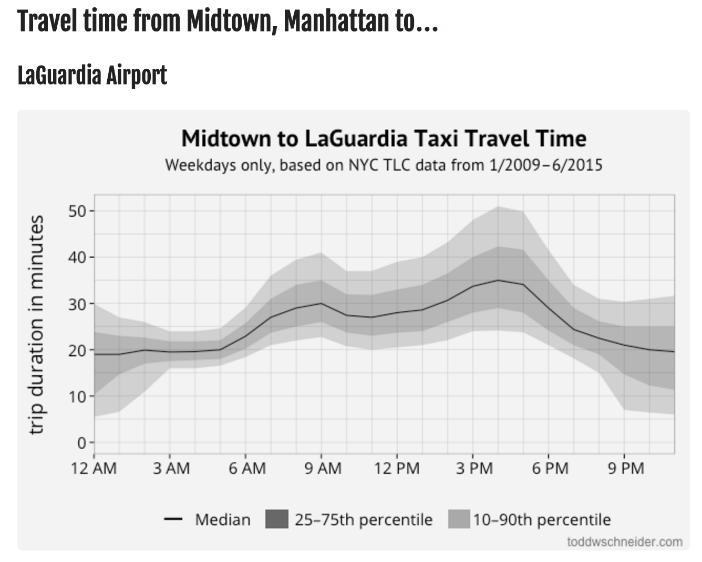

```{r setup, include=FALSE}
# knitr options
knitr::opts_chunk$set(echo = TRUE)
```

```{r, message=FALSE}
library(tidyverse)
library(lubridate)
library(stringr)
```


# Expected Travel Times for Bay Area Bike Share

## Description - Bay Area Bike Share

Shared city bikes have been a great success in many European cities, such as Berlin, and recently also in the US, with NYC having reached 22 million trips taken. Bikes are an essential piece of multimodal transportation with is the most sustainable and effective form of urban transportation. However, most cities still struggle make the transition from long to short distance trips easy and fluid. Therefore it is important to understand how humans use these systems, and how they could be improved. Luckily, most of the modern bike share systems collect data about the use of their offerings and share it publicly to advance the state of development.

Todd Schneider has created some amazing analyses with NYC taxi and bike data:

*	[NYC Taxi](http://toddwschneider.com/posts/analyzing-1-1-billion-nyc-taxi-and-uber-trips-with-a-vengeance/) 
* [NYC Bike](http://toddwschneider.com/posts/a-tale-of-twenty-two-million-citi-bikes-analyzing-the-nyc-bike-share-system/)



In this challenge, we will create similar visualizations, using data from the Bay Area Bike Share. In particular:

* Expected travel time for any given route based on hour of day


## Load Data
OPTIONAL:
The data is available online (3 years, 983,648 trips) from the [Bay Area Bike Share website](http://www.bayareabikeshare.com/open-data).

* Download the trip data for all years directly from the source and process it so that you can use it. 

SHORTCUT:
To save your time and nerves, you can find the pre-wrangled data on Box:  https://stanford.box.com/v/bike-data. 

* View the README.
* Download the trip data `station.rds` `trip.rds` from Box
* Use `read_rds()` to read in the files


```{r load data}
##==SOLUTION==##
## Base paths
path_base <- 'path/to/downloaded_data/'
path_year_all <- str_c(path_base, 'solution_data/')

## Paths Year all
# path_station_all <- str_c(path_year_all, 'station.rds')
# path_status_all <- str_c(path_year_all, 'status.rds')
path_trip_all <- str_c(path_year_all, 'trip.rds')
# path_weather_all <- str_c(path_year_all, 'weather.rds')

# station <- read_rds(path_station_all)
trip <- read_rds(path_trip_all)
##==SOLUTION==##
```

* Check whether each trip_id distinctly identifies a trip
* How can you identify a route, consisting of a from- and to-station? Look at `start_station`, `start_terminal` and `end_station`, `end_terminal`. Hint: By looking at the README, you can see that some stations were moved and renamed.


```{r Data Check - trip_id, routes}
##==SOLUTION==##
##Data consistency check (trip_id):
n_distinct(trip$trip_id) == nrow(trip)

##Data consistency check (routes):
all_4 <- trip %>% 
  count(start_station, start_terminal, end_station, end_terminal) %>% 
  nrow()
station_only <- trip %>% 
  count(start_station, end_station) %>% 
  nrow()
terminal_only <- trip %>% 
  count(start_terminal, end_terminal) %>% 
  nrow()

all_4
station_only
terminal_only
##==SOLUTION==##
```

--SOLUTION--
There are 2139 start-end combinations using both terminal numbers and station names, which is identical to the 2139 start-end combinations using only station names.
The 1920 combinations we get using only terminal codes, lack few stations, as some stations were renamed and moved.
Station names uniquely identify routes.
--SOLUTION--

## Analyze Data 
Modify trip. You can find the solution on Box. Hint: This step is really short, but you might need `lubridate`.

* Add the variable `start_time` to represent the hour in which the trip started (int)
* Change the duration to minutes (numeric)

```{r}
##==SOLUTION==##
trip <- trip %>%
  mutate(
    start_time = hour(start_date),
    duration = duration / 60
  )
trip %>% write_rds(str_c(path_year_all, 'solution_trip.rds'))
##==SOLUTION==##
```

Create a new tibble `routes_ETT` for each bidirectional route (combining trip data in both directions). We will use station names as identifiers. Here you will be able to use some of the tricks we learned in the last few weeks. You can find the solution on Box.

* Compute the hourly travel time percentiles $10\%, 25\%, 50\%, 75\%, 90\%$
* Save in `routes_ETT` the following variables: `station_1`,  `station_2`,  `start_time`, `n`,          `p10`,       `p25`,       `p50`,        `p75`,        `p90`
* Sort `station_1`,  `station_2` such that `station_1` comes first in the alphabet compared to `station_2`.
* arrange by `station_1`, `station_2`, `start_time`

```{r route pairs}
##==SOLUTION==##
probs <- c(0.10, 0.25, 0.50, 0.75, 0.90)
routes_ETT <- 
  trip %>%
  filter(start_station != end_station) %>% 
  mutate(
    station_1 = if_else(start_station < end_station, start_station, end_station),
    station_2 = if_else(start_station > end_station, start_station, end_station)) %>% 
  group_by(station_1, station_2, start_time) %>% 
  summarise(
    n = n(), 
    p = list(probs), 
    q = list(quantile(duration, probs))
    ) %>% 
  unnest() %>% 
  ungroup() %>% 
  spread(key = p, value = q) %>% 
  rename(p10 = `0.1`, p25 = `0.25`, p50 = `0.5`, p75 = `0.75`, p90 = `0.9`) %>% 
  arrange(station_1, station_2, start_time)

routes_ETT %>% write_rds(str_c(path_year_all, 'solution_routes_ETT.rds'))
##==SOLUTION==##
```

Analyze the travel frequency of routes:

* What is the percentage of routes that were travelled more than 1000 times?

```{r frequent routes}
##==SOLUTION==##
routes <-
  routes_ETT %>%
  group_by(station_1, station_2) %>%
  count(wt = n) %>% 
  arrange(-nn)

freq_routes <- routes %>% filter(nn >= 1000)

print(str_c('Frequent Routes: ', 
            100*(freq_routes %>% nrow()) / (routes %>% nrow()), '%'))
## Solution:  "Frequent Routes: 24.3169398907104%"
##==SOLUTION==##
##==BONUS-PLOT==##
routes %>% 
  ggplot(aes(nn)) +
  geom_histogram(binwidth = 100)

routes %>% 
  ggplot(aes(log10(nn))) +
  geom_histogram(binwidth = 0.1)
##==BONUS-PLOT==##
```


## Plot Travel Time for Routes

Now we are ready to plot the percentiles for the stations. 

* Create a function, that takes two station names and generates a plot showing the expected travel time of the route, with
* bands of 10th to 90th percentile, 
* band for the two quartiles 
* a line for the median, with thickness according to number of rentals
* exclude hours with less than 10 rentals

Hint: `geom_ribbon()` might be useful.


```{r plot function, warning=FALSE}
##==SOLUTION==##
plot_ETT <- function(station_1_, station_2_) {
  routes_ETT %>% 
    filter(station_1 == station_1_, 
           station_2 == station_2_,
           n >= 20) %>% 
    ggplot(aes(start_time)) +
    geom_ribbon(aes(ymin = p10, ymax = p90), fill = "grey80") +
    geom_ribbon(aes(ymin = p25, ymax = p75), fill = "grey70") +
    geom_line(aes(y = p50, size = n), color = 'black') +
    scale_x_continuous(limits = c(0, 24), 
                       breaks = seq(from = 0, to = 24, by = 4)) +
    labs(x = 'Start of trip (hour)', y = 'Trip duration (min)',
         title = str_c('Expected travel time for route:', station_1_, '-\n', 
                       station_2_, sep = ' ')) +
    guides(size = guide_legend(title = 'Rentals in hour',
                               reverse = TRUE))
}
##==SOLUTION==##
```


```{r, warning=FALSE}
##==BONUS-TEST==##
## Testing
# station_1 <- routes$station_1[1]
# station_2 <- routes$station_2[1]
# plot_ETT(station_1, station_2)
##==BONUS-TEST==##
```

Finally, 

* Create plots for the 5 most frequented routes in the dataset
* Interpret what you see

Hint: a for loop feeding the top5 from our route analysis to the plot function might do the job. You can find the solution on Box.

```{r solution_top5_plots, warning=FALSE, out.width='100%', out.height=10, out.width=15}
##==SOLUTION==##
for (i in 1:5) {
  p <- plot_ETT(routes$station_1[i] , routes$station_2[i])
  print(p)
}
##==SOLUTION==##
```

--SOLUTION--

* Most rental occur during typical commuter hours, 7-10am and 4-8pm.
* At most stations, the rentals are too low during the night, to display the extected travel times.
* During hours with many rentals, the expected travel time in best and worst case is closer together than in hours with low rental numbers.
* During low renal times, such as midday and evening, the upper percentiles and sometimes even the median indicate substantially longer expected travel times. The underlying reason for this could be a change in user-group. A person renting the bike for a commute to thir workplace will tend to use the bike as short as necessary. A casual renter who is exploring the area, however, has a different incentive and might use the bike substantially longer than the route would require to be travelled.

--SOLUTION--


